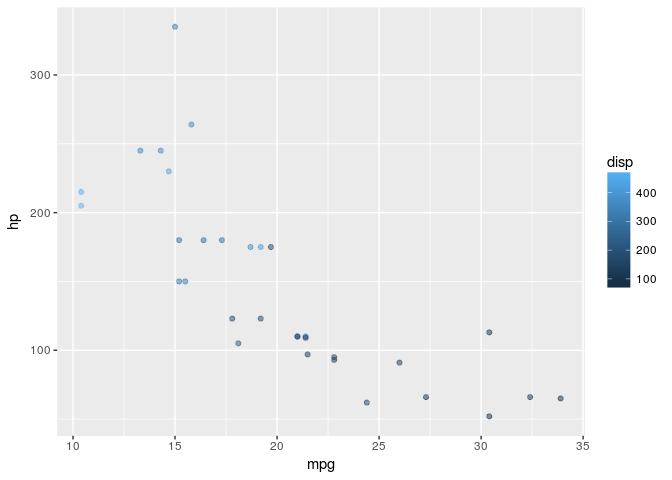
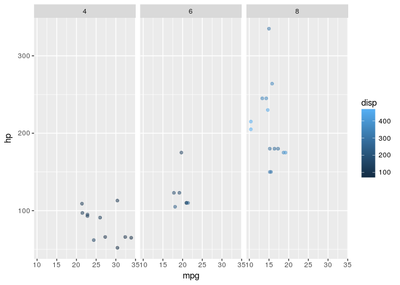
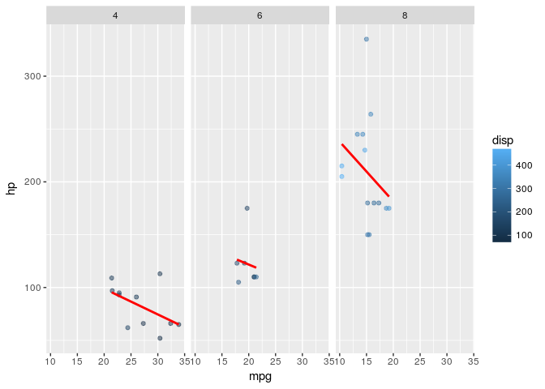
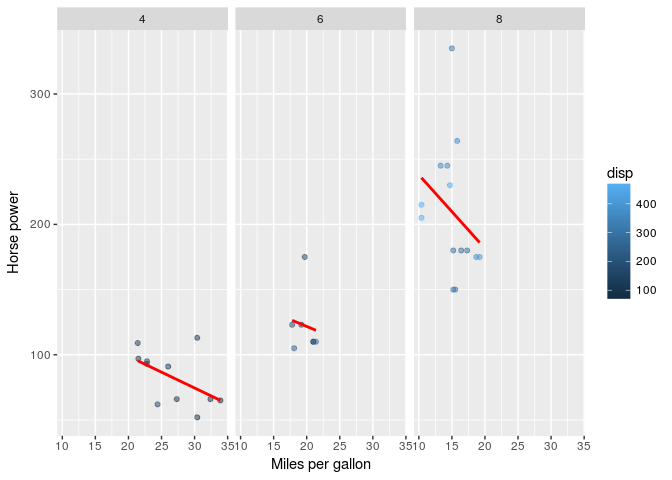
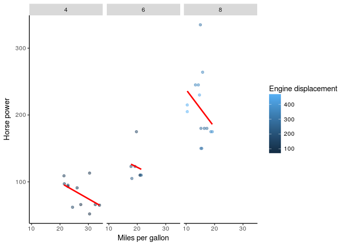
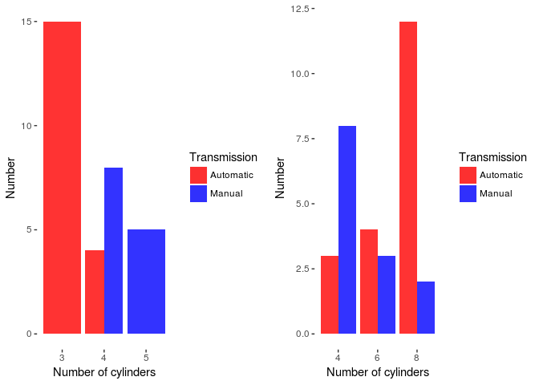
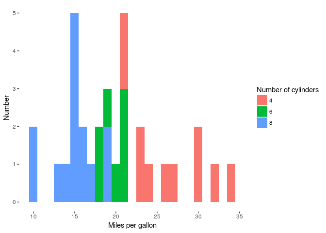
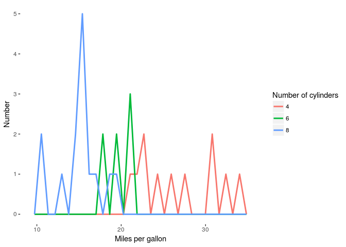

ggplot2 notes and practice
================
Atreya
27 February 2018

### Grammar of Graphics

Just like sentences, plots also have a grammar. Consider the sentence below for instance

*The quick brown fox jumps over the lazy dog*

Each word is an important element and has a role to play in this sentence

-   *The*- Article
-   *quick brown*- Adjective
-   *fox*- Noun
-   *jumps*- Verb
-   *over*- Preposition
-   *the* - Article
-   *lazy* - Adjective
-   *dog* - Noun

In a similar fashion, even a plotting framework consists of certain essential elements that make a plot meaningful as a whole

| **Element**   | **Descrption**                                   |
|---------------|--------------------------------------------------|
| *Data*        | The dataset being plotted                        |
| *Aesthetics*  | The scales onto which we *map* our data          |
| *Geometries*  | The visual elements used for data                |
| *Facets*      | Plotting small multiples                         |
| *Statistics*  | Representations of our data to aid unverstanding |
| *Coordinates* | The space on which the data will be plotted      |
| *Theme*       | All non-data ink                                 |

<table>
<colgroup>
<col width="15%" />
<col width="84%" />
</colgroup>
<thead>
<tr class="header">
<th><strong>Element</strong></th>
<th><strong>Example</strong></th>
</tr>
</thead>
<tbody>
<tr class="odd">
<td><em>Data</em></td>
<td>Variables of interest</td>
</tr>
<tr class="even">
<td><em>Aesthetics</em></td>
<td>x-axis, y-axis, color, fill, size, labels, alpha, shape, line width, line type</td>
</tr>
<tr class="odd">
<td><em>Geometries</em></td>
<td>point, line, histogram, bar, boxplot</td>
</tr>
<tr class="even">
<td><em>Facets</em></td>
<td>columns, rows</td>
</tr>
<tr class="odd">
<td><em>Statistics</em></td>
<td>binning, smoothing, descriptive, inferential</td>
</tr>
<tr class="even">
<td><em>Coordinates</em></td>
<td>cartesian, fixed, polar, limits</td>
</tr>
<tr class="odd">
<td><em>Theme</em></td>
<td>non-data ink</td>
</tr>
</tbody>
</table>

Load the standard `mtcars` dataset and check its structure

``` r
library(ggplot2)
library(dplyr)
library(gridExtra)
data("mtcars")
str(mtcars)
```

    ## 'data.frame':    32 obs. of  11 variables:
    ##  $ mpg : num  21 21 22.8 21.4 18.7 18.1 14.3 24.4 22.8 19.2 ...
    ##  $ cyl : num  6 6 4 6 8 6 8 4 4 6 ...
    ##  $ disp: num  160 160 108 258 360 ...
    ##  $ hp  : num  110 110 93 110 175 105 245 62 95 123 ...
    ##  $ drat: num  3.9 3.9 3.85 3.08 3.15 2.76 3.21 3.69 3.92 3.92 ...
    ##  $ wt  : num  2.62 2.88 2.32 3.21 3.44 ...
    ##  $ qsec: num  16.5 17 18.6 19.4 17 ...
    ##  $ vs  : num  0 0 1 1 0 1 0 1 1 1 ...
    ##  $ am  : num  1 1 1 0 0 0 0 0 0 0 ...
    ##  $ gear: num  4 4 4 3 3 3 3 4 4 4 ...
    ##  $ carb: num  4 4 1 1 2 1 4 2 2 4 ...

``` r
head(mtcars)
```

    ##                    mpg cyl disp  hp drat    wt  qsec vs am gear carb
    ## Mazda RX4         21.0   6  160 110 3.90 2.620 16.46  0  1    4    4
    ## Mazda RX4 Wag     21.0   6  160 110 3.90 2.875 17.02  0  1    4    4
    ## Datsun 710        22.8   4  108  93 3.85 2.320 18.61  1  1    4    1
    ## Hornet 4 Drive    21.4   6  258 110 3.08 3.215 19.44  1  0    3    1
    ## Hornet Sportabout 18.7   8  360 175 3.15 3.440 17.02  0  0    3    2
    ## Valiant           18.1   6  225 105 2.76 3.460 20.22  1  0    3    1

Explanation of some variables names :

`drat` - Rear axle ratio, `disp`-Engine Displacement(in), `qsec`- 1/4 mile time, `vs`- V/S engine, `am`- Transmission (0=automatic,1=manual), `gear`- number of forward gears, `carb`- number of carburetors

Some variables need to be converted to factors before we go ahead with plotting

``` r
mtcars %>% select(cyl) %>% n_distinct()
```

    ## [1] 3

``` r
mtcars %>% select(vs) %>% n_distinct()
```

    ## [1] 2

``` r
mtcars %>% select(am) %>% n_distinct()
```

    ## [1] 2

``` r
mtcars %>% select(gear) %>% n_distinct()
```

    ## [1] 3

``` r
mtcars %>% select(carb) %>% n_distinct()
```

    ## [1] 6

``` r
fact_cols <- c("cyl","am","gear","carb","vs")
mtcars[fact_cols]<-lapply(mtcars[fact_cols], factor) 
```

### Horse power vs MPG :Layer by layer build of the plot

#### Step 1: Data and aesthetics elements

``` r
p <- ggplot(mtcars,aes(x=mpg,y=hp,col=disp))
p+geom_point(alpha=0.5)
```



#### Step2: Facets

``` r
p <- ggplot(mtcars,aes(x=mpg,y=hp,col=disp))
p+geom_point(alpha=0.5)+
  facet_grid(.~cyl)
```



#### Step3: Statistics layer

``` r
p <- ggplot(mtcars,aes(x=mpg,y=hp,col=disp))
p+geom_point(alpha=0.5)+
  facet_grid(.~cyl)+
  stat_smooth(method="lm",se=FALSE,col="red")
```



#### Step 4: Coordinates layer

``` r
p <- ggplot(mtcars,aes(x=mpg,y=hp,col=disp))
p+geom_point(alpha=0.5)+
  facet_grid(.~cyl)+
  stat_smooth(method="lm",se=FALSE,col="red")+
  scale_x_continuous("Miles per gallon")+
  scale_y_continuous("Horse power")
```



#### Step 5: Theme layer

``` r
p <- ggplot(mtcars,aes(x=mpg,y=hp,col=disp))
p+geom_point(alpha=0.5)+
  facet_grid(.~cyl)+
  stat_smooth(method="lm",se=FALSE,col="red")+
  scale_x_continuous("Miles per gallon",breaks = c(10,20,30))+
  labs(y="Horse power",col="Engine displacement")+
  theme(panel.background = element_blank(),
        plot.background = element_blank(),
        axis.line = element_line(colour = "black"),
        panel.grid = element_blank())
```



#### Bar plots

``` r
bar_1 <-ggplot(mtcars,aes(x=gear,fill=am))+
        geom_bar(position = "dodge",alpha=0.8)+
        labs(x="Number of cylinders",y="Number")+
        scale_fill_manual("Transmission",labels=c("Automatic","Manual"),values=c("red","blue"))+
        theme(panel.background = element_rect(fill = "white"),panel.grid = element_blank())

bar_2 <-ggplot(mtcars,aes(x=cyl,fill=am))+
        geom_bar(position = "dodge",alpha=0.8)+
        labs(x="Number of cylinders",y="Number")+
        scale_fill_manual("Transmission",labels=c("Automatic","Manual"),values=c("red","blue"))+
        theme(panel.background = element_rect(fill = "white"),panel.grid = element_blank())
grid.arrange(bar_1,bar_2,ncol=2)
```



#### Histogram

``` r
ggplot(mtcars,aes(x=mpg,fill=cyl))+
geom_histogram(binwidth = 1)+
labs(x="Miles per gallon",y="Number",fill="Number of cylinders")+
theme(panel.background=element_rect(fill="white"),panel.grid=element_blank())
```



``` r
ggplot(mtcars,aes(x=mpg,col=cyl))+
geom_freqpoly(lwd=1)+
labs(x="Miles per gallon",y="Number",col="Number of cylinders")+
theme(panel.background=element_rect(fill="white"),panel.grid=element_blank())
```


